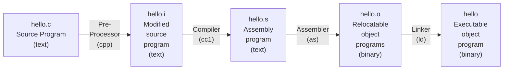

# Chapter1 - 컴퓨터 시스템으로의 여행
- 컴퓨터 시스템은 하드웨어와 시스템 소프트웨어로 구성되며, 이들이 함께 작동하여 응용 프로그램을 실행한다.
- 간단한 hello world 프로그램이 실행되어 종료되기 위해서는 시스템의 주요 부분들이 조화로벡 동작해야 하고, 이 책을 통해 그 과정에서 무슨일이 일어나고 왜 일어나는지 이해할 수 있다
- 시스템 공부의 시작은 hello world 프로그램이 프로그래머에 의해 만들어지고, 시스템에서 실행되고, 단순한 메세지를 출력하고, 종료될 때까지의 수명주기를 추적하는 것으로 시작한다.
## 1.1 정보는 비트와 컨텍스트로 이루어진다
- hello 프로그램은 개발자가 에디터로 작성한 소스파일로 생명을 시작한다.
- 이는 hello.c 라는 텍스트 파일로 저장된다.
- 소스프로그램은 0 또는 1로 표시되는 비트들의 연속이다.
- 바이트라는 8비트 다누이로 구성된다
- 각 바이트는 프로그램의 텍스트 문자를 나타낸다.
- 컴퓨터 시스템은 텍스트 문자를 ASCII 표준을 사용하여 표시한다.
- ASCII 표준은 각 문자를 바이트 길이의 정수 값으로 나타낸다.
    - 각 바이트는 특정 문자에 대응되는 정수 값을 갖는다.
- 오로지 ASCII  문자로 이루어진 파일들은 텍스트 파일이라고 부른다
- 다른 모든 파일들은 바이너리 파일이라고 한다.
- 시스템 내의 모든 내부 정보 (디스크 파일, 메모리상의 프로그램, 데이터, 네트워크 통해 전송되는 데이터)는 비트들로 표시된다.
- 서로 다른 객체들을 구분하는 유일한 방법은 이들을 바라보는 컨텍스트에 의해서다.
    - 다른 컨텍스트에서 동일한 일련의 바이트가 정수, 부동소수, 문자열 또는 기계어 명령을 의미할 수 있다.
## 1.2 프로그램은 다른 프로그램에 의해 다른 형태로 번역된다.
- hello 프로그램은 인간이 바로 이해하고 읽을 수있는 고급 C 프로그램이다.
- 그러나 이를 시스템에서 실행시키려면 각 C 문장들은 다른 프로그램들에 의해 저급 기계어 인스트럭션으로 번역되어야 한다.
- 이 인스트럭션들은 **실행가능 목적 프로그램**이라고 하는 형태로 합쳐져서 바이너리 디스크 파일로 저장된다.
    - 목적프로그램은 실행가능 목적 파일 이라고도 부른다.
- 컴파일러 드라이버는 유닉스 시스템에서 다음과 같이 소스파일에서 오브젝트 파일로 번역한다.
    - linux> gcc -o hello hello.c
- GCC 컴파일러 드라이버는 소스파일 hello.c를 읽어서 실행파일인 hello로 번역한다.
- 번역은 4개의 단계를 거쳐서 실행된다


- 이 4단계를 실행하는 프로그램들 (전처리기, 컴파일러, 어셈블러, 링커)을 합쳐서 컴파일 시스템이라고 부른다.
    - 전처리 단계
        - 전처리기 (cpp)는 본래의 C 프로그램을 #문자로 시작하는 디렉티브에 따라 수정한다.
        - 파일 첫줄의 #include<stdio.h>는 전처리기에게 시스템 헤더파일인 stdio.h를 프로그램 문장에 직접 삽입하라고 지시한다.
        - 그 결과는 일반적으로 .i로 끝나는 새로운 C 프로그램이 생성된다.
    - 컴파일 단계
      - 컴파일러는 hello.i -> hello.s로 변환하며 이는 어셈블리어 프로그램.
      ```assembly
      main:
        subq $8, %rsp
        movl $.LCO, %edi
        call puts
        movl $0, %eax
        addq $8, %rsp
        ret 
      ```
    - 어셈블리 단계
      - 어셈블러가 hello.s를 기계어 인스트럭션으로 번역하고 이들을 재배치가능 목적프로그램 형태로 묶어서 hello.o 파일에 저장
      - main 함수의 인스트럭션을 인코딩하기 위한 17바이트를 포함하는 바이너리 파일
      - 인간이 알아보기 힘듬
    - 링크 단계
      - 표준 C 라이브러리에 들어 있는 printf 함수를 호출하는데 주목
        - 이미 컴파일된 별도의 목적 파일인 printf.o에 들어 있음
        - 이 파일은 hello.o와 결합 되어야 함
        - 링커 프로그램(ld)가 이 작업을 수행
        - 결과인 hello 파일은 목적파일(실행파일)로 메모리에 적재되어 시스템에 의해 실행된다.
## 1.3 컴파일 시스템이 어떻게 동작하는지 이해하는 것은 중요하다
- 프로그램 성능 최적화
  - 최신 컴파일러는 대게 우수한 결과물을 내지만 C 프로그램 작성 시 올바른 코드를 위해서는 기계어 수준 코드에 대한 이해가 필요
    - 어떻게 C 문장을 기계어 코드로 번역하는지?
    - switch 는 if-else 여러개보다 효율적인가?
    - while vs for loop ?
  - 링크 에러 이해하기
    - 큰 규모 시스템에서 가장 당혹스러운 에러는 링커관련이다.
      - 링커가 어떤 참조를 풀어낼 수 없다고 할 때
      - 동일한 이름의 전역변수가 여러개 존재
      - 정적 라이브러리와 동적 라이브러리의 차이
      - 링커 관련 에러는 실행하기 전까지 발생하지 않는 이유
    - 보안 약점 피하기
      - 버퍼 오버플로우는 오래동안 주요 보안 약점 원인 이었다
        - 데이터의 양과 형태를 주의깊게 제한 해야할 필요를 간과했기 때문
      - secure coding의 첫 단계는 프로그램 스택에 데이터와 제어 정보가 저장되는 방식 때문에 생겨나는 영향을 이해하는 것이다
## 1.4 프로세서는 메모리에 저장된 인스트럭션을 읽고 해석한다.
- hello.c 소스 프로그램은 컴파일 시스템에 의해 hello라는 실행가능한 목적파일로 번역되어 디스크에 저장되었다,
- 이 실행파일을 유닉스 시스템에서 실행하기 위해 쉘에 이름을 입력한다
```shell
linux> ./hello
hello, world
linux>
```

### 1.4.1 시스템의 하드웨어 조직
- hello 프로그램을 실행할 때 무슨 일이 일어나는지 설명하기 위해서는 전형적인 시스템에서의 하드웨어 조직을 이해할 필요가 있다

- 버스
  - 시스템 내를 관통하는 전기적 배선군
  - 컴포넌트들 간에 바이트 정보를 전송함
  - word라고 하는 고정 크기의 바이트 단위로 데이터를 전송하도록 설계됨
  - 대부분 컴퓨터들은 4바이트 또는 8바이트 워드 크기
- 입출력 장치
  - 시스템과 외부 세계와의 연결을 담당
    - 입력용 키보드, 마우스, 출력용 디스플레이, 데이터와 프로그램의 장기 저장을 위한 디스크 드라이브
    - 각 IO 장치는 입출력 버스와 컨트롤러나 어댑터를 통해서 연결된다
      - 이 두 장치의 차이는 패키징에 있다.
      - 컨트롤러는 디바이스 자체가 칩셋이거나 시스템의 인쇄기판(머더보드)에 장착된다
      - 어댑터는 머더보드의 슬롯에 장착되는 카드이다
  - 메인메모리
    - 프로세서가 프로그램을 실행하는 동안 데이터와 프로그램을 모두 저장하는 임시 장치이다.
    - 물리적으로 메인 메모리는 DRAM (Dynamic Random Access Memory) 칩들로 구성되어 있다.
    - 논리적으로는 연속적인 바이트의 배열로 각 0부터 시작해서 고유의 주소(배열 인덱스)를 갖ㄴ,ㄴ다
  - 프로세서
    - CPU는 메인 메모리에 저장된 인스트럭션들을 해독(실행)하는 엔진이다
    - 프로세서의 중심에는 워드 크기의 저장장치(혹은 레지스터)인 프로그램 카운터(PC)가 있다.
    - 시스템에 전원이 공급되는 순간부터 전원이 끊어질 때까지 프로세서는 PC가 가리키는 곳의 인스트럭션을 반복적으로 실행하고 PC값이 다음 인스트럭션의 위치를 가리키도록 업데이트 한다.
    - 프로세서는 자신의 인스트럭션 집합 구조로 정의되는 매우 단순한 인스트럭션 실행 모델을 따라 작동하는 것처럼 보인다.
      - 프로세서는 PC가 가리키는 메모리로 부터 인스트럭션을 읽음
      - 이 인스트럭션에서 비트들을 해석해서 인스트럭션이 지정하는 동작 수행
      - PC를 다음 인스트럭션 위치로 업데이트 한다
    - 이런 단순한 동작만이 있음
      - 이들은 메인 메로리, 레지스터 파일, ALU 주위를 순환한다.
      - 레지스터 파일은 각 고유의 이름을 갖는 워드 크기의 레지스터 집합으로 구성되어 있다
      - ALU는 새 데이터와 주소 값을 계산한다.
    - 예시
      - 적재 (Load)
        - 메인 메모리에서 레지스터에 한 바이트 또는 워드를 이전 값에 덮어쓰는 방식으로 복사
      - 저장 (Store)
        - 레지스터에서 메인 메모리로 한 바이트 또는 워드를 이전 값을 덮어쓰는 방식으로 복사
      - 작업 (Operate)
        - 두 레지스터의 값을 ALU로 복사하고 두 개의 워드로 수식 연산을 수행한 뒤 결과를 덮어쓰기 방식으로 레지스터에 저장
      - Jump
        - 인스트럭션 자신으로부터 한 개의 워드를 추출하고 이것을 PC에 덮어쓰기 방식으로 복사