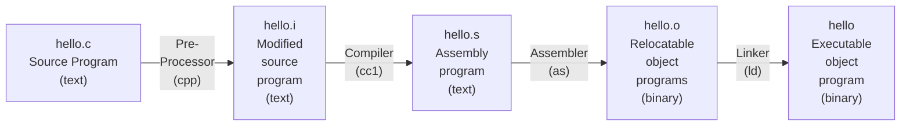

# Chapter1 - 컴퓨터 시스템으로의 여행
- 컴퓨터 시스템은 하드웨어와 시스템 소프트웨어로 구성되며, 이들이 함께 작동하여 응용 프로그램을 실행한다.
- 간단한 hello world 프로그램이 실행되어 종료되기 위해서는 시스템의 주요 부분들이 조화로벡 동작해야 하고, 이 책을 통해 그 과정에서 무슨일이 일어나고 왜 일어나는지 이해할 수 있다
- 시스템 공부의 시작은 hello world 프로그램이 프로그래머에 의해 만들어지고, 시스템에서 실행되고, 단순한 메세지를 출력하고, 종료될 때까지의 수명주기를 추적하는 것으로 시작한다.
## 1.1 정보는 비트와 컨텍스트로 이루어진다
- hello 프로그램은 개발자가 에디터로 작성한 소스파일로 생명을 시작한다.
- 이는 hello.c 라는 텍스트 파일로 저장된다.
- 소스프로그램은 0 또는 1로 표시되는 비트들의 연속이다.
- 바이트라는 8비트 다누이로 구성된다
- 각 바이트는 프로그램의 텍스트 문자를 나타낸다.
- 컴퓨터 시스템은 텍스트 문자를 ASCII 표준을 사용하여 표시한다.
- ASCII 표준은 각 문자를 바이트 길이의 정수 값으로 나타낸다.
    - 각 바이트는 특정 문자에 대응되는 정수 값을 갖는다.
- 오로지 ASCII  문자로 이루어진 파일들은 텍스트 파일이라고 부른다
- 다른 모든 파일들은 바이너리 파일이라고 한다.
- 시스템 내의 모든 내부 정보 (디스크 파일, 메모리상의 프로그램, 데이터, 네트워크 통해 전송되는 데이터)는 비트들로 표시된다.
- 서로 다른 객체들을 구분하는 유일한 방법은 이들을 바라보는 컨텍스트에 의해서다.
    - 다른 컨텍스트에서 동일한 일련의 바이트가 정수, 부동소수, 문자열 또는 기계어 명령을 의미할 수 있다.
## 1.2 프로그램은 다른 프로그램에 의해 다른 형태로 번역된다.
- hello 프로그램은 인간이 바로 이해하고 읽을 수있는 고급 C 프로그램이다.
- 그러나 이를 시스템에서 실행시키려면 각 C 문장들은 다른 프로그램들에 의해 저급 기계어 인스트럭션으로 번역되어야 한다.
- 이 인스트럭션들은 **실행가능 목적 프로그램**이라고 하는 형태로 합쳐져서 바이너리 디스크 파일로 저장된다.
    - 목적프로그램은 실행가능 목적 파일 이라고도 부른다.
- 컴파일러 드라이버는 유닉스 시스템에서 다음과 같이 소스파일에서 오브젝트 파일로 번역한다.
    - linux> gcc -o hello hello.c
- GCC 컴파일러 드라이버는 소스파일 hello.c를 읽어서 실행파일인 hello로 번역한다.
- 번역은 4개의 단계를 거쳐서 실행된다

- 이 4단계를 실행하는 프로그램들 (전처리기, 컴파일러, 어셈블러, 링커)을 합쳐서 컴파일 시스템이라고 부른다.
    - 전처리 단계
        - 전처리기 (cpp)는 본래의 C 프로그램을 #문자로 시작하는 디렉티브에 따라 수정한다.
        - 파일 첫줄의 #include<stdio.h>는 전처리기에게 시스템 헤더파일인 stdio.h를 프로그램 문장에 직접 삽입하라고 지시한다.
        - 그 결과는 일반적으로 .i로 끝나는 새로운 C 프로그램이 생성된다.