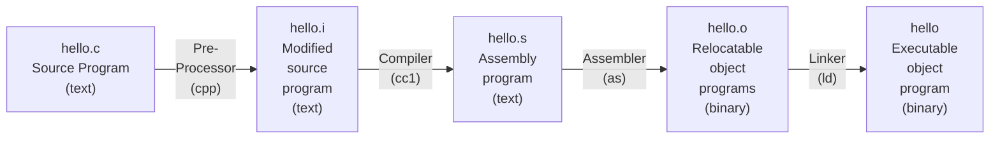

# Chapter1 - 컴퓨터 시스템으로의 여행
- 컴퓨터 시스템은 하드웨어와 시스템 소프트웨어로 구성
- hello world 프로그램이 프로그래머에 의해 만들어지고, 시스템에서 실행되고, 단순한 메세지를 출력하고, 종료될 때까지의 수명주기를 추적하는 것으로 시작한다.
## 1.1 정보는 비트와 컨텍스트로 이루어진다
- hello 프로그램
  - 개발자가 에디터로 작성한 소스파일
  - hello.c 라는 텍스트 파일로 저장된다.
  - 소스프로그램은 0 또는 1로 표시되는 비트들의 연속이다.
- 바이트는 8비트 단위로 구성된다
  - 문자 하나가 하나의 바이트
- 컴퓨터 시스템은 텍스트 문자를 ASCII 표준을 사용하여 표시한다.
  - ASCII 표준은 각 문자를 바이트 길이의 정수 값으로 나타낸다.
      - 각 바이트는 특정 문자에 대응되는 정수 값을 갖는다.
  - 오로지 ASCII  문자로 이루어진 파일들은 텍스트 파일이라고 부른다
- 다른 모든 파일들은 바이너리 파일이라고 한다.
- 시스템 내의 모든 내부 정보 (디스크 파일, 메모리상의 프로그램, 데이터, 네트워크 통해 전송되는 데이터)는 비트들로 표시된다.
- 서로 다른 객체들을 구분하는 유일한 방법은 이들을 바라보는 컨텍스트에 의해서다.
    - 다른 컨텍스트에서 동일한 일련의 바이트가 정수, 부동소수, 문자열 또는 기계어 명령을 의미할 수 있다.
## 1.2 프로그램은 다른 프로그램에 의해 다른 형태로 번역된다.
- hello 프로그램은 인간이 바로 이해하고 읽을 수있는 고급 C 프로그램
- 그러나 이를 시스템에서 실행시키려면 각 C 문장들은 다른 프로그램들에 의해 저급 기계어 인스트럭션으로 번역되어야 한다.
- 이 인스트럭션들은 **실행가능 목적 프로그램**이라고 하는 형태로 합쳐져서 바이너리 디스크 파일로 저장된다.
- 컴파일러 드라이버는 유닉스 시스템에서 다음과 같이 소스파일에서 오브젝트 파일로 번역한다.
    - linux> gcc -o hello hello.c
- GCC 컴파일러 드라이버는 소스파일 hello.c를 읽어서 실행파일인 hello로 번역한다.
- 번역은 4개의 단계를 거쳐서 실행된다


- 이 4단계를 실행하는 프로그램들 (전처리기, 컴파일러, 어셈블러, 링커)을 합쳐서 컴파일 시스템이라고 부른다.
    - 전처리 단계
        - 전처리기 (cpp)는 본래의 C 프로그램을 #문자로 시작하는 디렉티브에 따라 수정한다.
        - 파일 첫줄의 #include<stdio.h>는 전처리기에게 시스템 헤더파일인 stdio.h를 프로그램 문장에 직접 삽입하라고 지시한다.
        - 그 결과는 일반적으로 .i로 끝나는 새로운 C 프로그램이 생성된다.
    - 컴파일 단계
      - 컴파일러는 hello.i -> hello.s로 변환하며 이는 어셈블리어 프로그램.
      ```assembly
      main:
        subq $8, %rsp
        movl $.LCO, %edi
        call puts
        movl $0, %eax
        addq $8, %rsp
        ret 
      ```
    - 어셈블리 단계
      - 어셈블러가 hello.s를 기계어 인스트럭션으로 번역하고 이들을 재배치가능 목적프로그램 형태로 묶어서 hello.o 파일에 저장
      - main 함수의 인스트럭션을 인코딩하기 위한 17바이트를 포함하는 바이너리 파일
      - 인간이 알아보기 힘듬
    - 링크 단계
      - 표준 C 라이브러리에 들어 있는 printf 함수를 호출하는데 주목
        - 이미 컴파일된 별도의 목적 파일인 printf.o에 들어 있음
        - 이 파일은 hello.o와 결합 되어야 함
        - 링커 프로그램(ld)가 이 작업을 수행
        - 결과인 hello 파일은 목적파일(실행파일)로 메모리에 적재되어 시스템에 의해 실행된다.
## 1.3 컴파일 시스템이 어떻게 동작하는지 이해하는 것은 중요하다
- 프로그램 성능 최적화
  - 최신 컴파일러는 대게 우수한 결과물을 내지만 C 프로그램 작성 시 올바른 코드를 위해서는 기계어 수준 코드에 대한 이해가 필요
    - 어떻게 C 문장을 기계어 코드로 번역하는지?
    - switch 는 if-else 여러개보다 효율적인가?
    - while vs for loop ?
  - 링크 에러 이해하기
    - 큰 규모 시스템에서 가장 당혹스러운 에러는 링커관련이다.
      - 링커가 어떤 참조를 풀어낼 수 없다고 할 때
      - 동일한 이름의 전역변수가 여러개 존재
      - 정적 라이브러리와 동적 라이브러리의 차이
      - 링커 관련 에러는 실행하기 전까지 발생하지 않는 이유
    - 보안 약점 피하기
      - 버퍼 오버플로우는 오래동안 주요 보안 약점 원인 이었다
        - 데이터의 양과 형태를 주의깊게 제한 해야할 필요를 간과했기 때문
      - secure coding의 첫 단계는 프로그램 스택에 데이터와 제어 정보가 저장되는 방식 때문에 생겨나는 영향을 이해하는 것이다
## 1.4 프로세서는 메모리에 저장된 인스트럭션을 읽고 해석한다.
- hello.c 소스 프로그램은 컴파일 시스템에 의해 hello라는 실행가능한 목적파일로 번역되어 디스크에 저장되었다,
- 이 실행파일을 유닉스 시스템에서 실행하기 위해 쉘에 이름을 입력한다
```shell
linux> ./hello
hello, world
linux>
```

### 1.4.1 시스템의 하드웨어 조직
- hello 프로그램을 실행할 때 무슨 일이 일어나는지 설명하기 위해서는 전형적인 시스템에서의 하드웨어 조직을 이해할 필요가 있다

- 버스
  - 시스템 내를 관통하는 전기적 배선군
  - 컴포넌트들 간에 바이트 정보를 전송함
  - word라고 하는 고정 크기의 바이트 단위로 데이터를 전송하도록 설계됨
  - 대부분 컴퓨터들은 4바이트 또는 8바이트 워드 크기
- 입출력 장치
  - 시스템과 외부 세계와의 연결을 담당
    - 입력용 키보드, 마우스, 출력용 디스플레이, 데이터와 프로그램의 장기 저장을 위한 디스크 드라이브
    - 각 IO 장치는 입출력 버스와 컨트롤러나 어댑터를 통해서 연결된다
      - 이 두 장치의 차이는 패키징에 있다.
      - 컨트롤러는 디바이스 자체가 칩셋이거나 시스템의 인쇄기판(머더보드)에 장착된다
      - 어댑터는 머더보드의 슬롯에 장착되는 카드이다
  - 메인메모리
    - 프로세서가 프로그램을 실행하는 동안 데이터와 프로그램을 모두 저장하는 임시 장치이다.
    - 물리적으로 메인 메모리는 DRAM (Dynamic Random Access Memory) 칩들로 구성되어 있다.
    - 논리적으로는 연속적인 바이트의 배열로 각 0부터 시작해서 고유의 주소(배열 인덱스)를 갖는다
  - 프로세서
    - CPU는 메인 메모리에 저장된 인스트럭션들을 해독(실행)하는 엔진이다
    - 프로세서의 중심에는 워드 크기의 저장장치(혹은 레지스터)인 프로그램 카운터(PC)가 있다.
    - 시스템에 전원이 공급되는 순간부터 전원이 끊어질 때까지 프로세서는 PC가 가리키는 곳의 인스트럭션을 반복적으로 실행하고 PC값이 다음 인스트럭션의 위치를 가리키도록 업데이트 한다.
    - 프로세서는 자신의 인스트럭션 집합 구조로 정의되는 매우 단순한 인스트럭션 실행 모델을 따라 작동하는 것처럼 보인다.
      - 프로세서는 PC가 가리키는 메모리로 부터 인스트럭션을 읽음
      - 이 인스트럭션에서 비트들을 해석해서 인스트럭션이 지정하는 동작 수행
      - PC를 다음 인스트럭션 위치로 업데이트 한다
    - 이런 단순한 동작만이 있음
      - 이들은 메인 메모리, 레지스터 파일, ALU 주위를 순환한다.
      - 레지스터 파일은 각 고유의 이름을 갖는 워드 크기의 레지스터 집합으로 구성되어 있다
      - ALU
        - 산술 논리 장치
        - 새 데이터와 주소 값을 계산한다.
    - 예시
      - 적재 (Load)
        - 메인 메모리에서 레지스터에 한 바이트 또는 워드를 이전 값에 덮어쓰는 방식으로 복사
      - 저장 (Store)
        - 레지스터에서 메인 메모리로 한 바이트 또는 워드를 이전 값을 덮어쓰는 방식으로 복사
      - 작업 (Operate)
        - 두 레지스터의 값을 ALU로 복사하고 두 개의 워드로 수식 연산을 수행한 뒤 결과를 덮어쓰기 방식으로 레지스터에 저장
      - Jump
        - 인스트럭션 자신으로부터 한 개의 워드를 추출하고 이것을 PC에 덮어쓰기 방식으로 복사
### 1.4.2 hello 프로그램의 실행
- 처음에 쉘 프로그램은 자신의 인스트럭션을 실행하면서 사용자의 명령 입력을 기다림
- /hello를 입력하면 쉘 프로그램은 각각의 문자를 레지스터에 읽어 들인 후 메모리에 저장한다.

- enter를 누르면 쉘은 명령 입력 끝남을 인지
- 쉘은 파일 내의 코드와 데이터를 복사하는 일련의 인스트럭션을 실행하여 실행 파일 hello를 디스크에서 메인 메모리로 로딩한다.
- 직접 메모리 접근(DMA) 기법을 이용해서 데이터는 프로세서를 거치지 않고 디스크에서 메인 메모리로 직접 이동한다

- hello 목적파일의 코드와 데이터가 메모리에 적재된 후 프로세서는 hello 프로그램의 main 루틴의 기계어 인스트럭션을 실행
- 이 인스트럭션들은 hello, world의 스트링을 메모리로부터 레지스터 파일로 복사
- 거기로부터 디스플레이 장치로 전송하여 화면에 글자들이 표시된다.
- 

## 1.5 캐시가 중요하다
- 시스템이 정보를 한 곳에서 다른 곳으로 이동시키는 일에 많은 시간을 보냄
- hello 프로그램은 본래 하드디스크에 적재됨
- 프로그램이 로딩될 때 이들은 메인 메모리로 복사됨
- hello world 데이터 스트링도 본래는 디스크에 저장되어 있음
  - 이것은 메인 메모리로 복사되었다가 디스플레이 장치로 복사됨
- 여러 복사과정이 bottle neck이 된다
- 물리학의 법칙에 의해 더 큰 저장장치들은 작은 저장장치보다 느린 속도를 갖고, 비용이 덜 든다.
  - 디스크 드라이브는 메인 메모리보다 1천배 크기가 크지만, 프로세서가 디스크에서 1워드의 데이터를 읽는데 걸리는 시간은 메모리보다 천만배 더 오래걸릴 수 있다
  - 일반적인 레지스터 파일은 수백 바이트의 정보를 저장한다
    - 메인 메모리는 십억 개의 바이트를 저장한다
    - 하지만 프로세서는 메모리보다 레지스터에서 100배 데이터를 빨리 읽을 수 있다
- 프로세서 - 메모리간 격차에 대응하기 위해 캐시 메모리가 고안됨
  - 프로세서가 단기간에 필요로 할 가능성 높은 정보를 임시 저장
  - L1 캐시
    - 프로세서 칩 내에 들어 있음
    - 대략 수천 바이트 데이터 저장 가능
    - 레지스터 파일만큼 빠름
  - L2 캐시
    - 수백 킬로바이트에서 수 메가 바이트 데이터 저장 가능
    - 프로세서와 전용 버스를 통해 연결된다
    - L1보다 5배 정도 느림
    - 메모리보다 5-10배 빠름
  - L1, L2 캐시는 SRAM(static random access memory) 이라는 하드웨어 기술을 이용해 구현한다
  - L3가 존재하는 시스템도 있음
  - 캐시 시스템은 프로그램이 지엽적인 영역의 코드와 데이터를 액세스하는 경향인 지역성을 활용하여 시스템이 매우 크고 빠른 메모리 효과를 얻을 수 있도록 하는 것
    - 자주 액세스할 가능성 높은 데이터를 캐싱해서 대부분의 메모리 작업을 수행할 수 있다
    - 10배 이상 성능을 빠르게 할 수 있다

## 1.6 저장장치들은 계층구조를 이룬다
- 캐시같은 보다 작고 빠른 저장장치를 프로세서와 좀 더 크고 느린 메모리 사이에 끼워 넣는 개념은 일반적이다
- 내려갈수록 느리고 더 크고 바이트 당 가격이 싸다
- 핵심은 한 레벨의 저장장치가 다음 하위레벨의 캐시 역할을 함


## 1.7 운영체제는 하드웨어를 관리한다
- 쉘 프로그램이 hello 프로그램을 로드하고 실행했을 때와 hello 프로그램이 메시지를 출력할 때 프로그램이 키보드, 디스플레이, 디스크나 메인 메모리에 직접 액세스하지 않았다
  - 운영체제가 제공하는 서비스를 활용한다
  - 응용 프로그램은 운영체제를 통해서만 하드웨어를 제어할 수 있다
  
  - 운영체제의 주요 목적
  1. 제멋대로 동작하는 응용프로그램들이 하드웨어를 잘못 사용하는 것을 막기 위해
  2. 응용프로그램들이 단순하고 균일한 메커니즘을 통해 복잡하고 매우 다른 저수준 하드웨어 장치를 조작하도록 하기 위해
  - 운영 체제는 이 목적을 근본적인 추상화를 통해 달성한다
    - 가상 메모리는 메인 메모리와 디스크 입출력 장치의 추상화
    - 프로세스는 프로세서, 메인 메모리, 입출력 장치 등 모두의 추상화
    
### 1.7.1 프로세스
- hello 같은 프로그램이 실행될 때 운영체제는 시스템에서 이 한 개의 프로그램이 실행되는 것 같은 착각이 들게 해준다
  - 프로그램이 프로세서, 메인 메모리, 입출력 장치를 독점하는 것처럼 보인다
  - 이 착각은 전산학에서 가장 중요한 프로세스라고 하는 개념에 의해서 만들어진다
- 프로세스
  - 실행 중인 프로그램에 대한 운영체제의 추상화
- 다수의 프로세스들은 동일한 시스템에서 동시에 실행될 수 있다
- 각 프로세스들은 하드웨어를 배타적으로 사용하는 것처럼 느껴진다
  - 멀티코어 프로세서들은 여러개의 프로그램을 동시에 실행 가능
  - 싱글 코어는 한 번에 한개의 프로그램만 실행 가능
  - 두 방식 다 프로세서가 프로세스들을 바꿔주는 방식으로 한 개의 CPU가 다수의 프로세스를 동시에 실행하는 것처럼 보이게 해준다
    - 운영체제는 CONTEXT SWITCHING을 사용해서 이러한 교차실행을 수행한다
- 운영체제는 프로세스가 실행하는 데 필요한 모든 상태정보의 변화를 추적한다. 
- 이는 컨텍스트이며 PC, 레지스터 파일, 메인 메모리의 현재 값 등을 포함한다.
- 단일 프로세서는 한 순간에 하나의 프로세스만 실행할 수 있다
  - 운영체제는 제어를 옮기려고 할때 현재 프로세스의 컨텍스트를 저장하고 새 프로세스의 컨텍스트를 복원시키는 CONTEXT SWITCHING을 수행하여 제어권을 새 프로세스로 넘겨준다
  - 새 프로세스는 이전에 중단했던 바로 그 위치부터 다시 실행된
  - 아래는 두 개의 동시성 프로세스가 존재
    - 쉘 프로세스
    - hello 프로세스
  - 쉘이 혼자 동작
  - hello 프로그램 실행 명령 받음
  - 쉘은 시스템 콜이라는 특수 함수를 호출해서 운영체제로 제어권을 넘겨준다
  - 운영체제는 쉘의 컨텍스트를 저장하고 새로운 hello 프로세스와 컨텍스트를 생성
  - 제어권을 hello 프로세스로 넘겨준다
  - hello가 종료되면 운영체제는 쉘 프로세스의 컨텍스트를 복구시키고 제어권을 넘겨준다
  - 쉘은 다음 명령 줄 입력을 기다린다
  
  - 프로세스간 전환은 운영체제 커널에 의해 관리된다
  - 커널
    - 운영체제 코드의 일부분으로, 메모리에 상주한다.
    - 응용프로그램이 운영체제에 의한 어떤 작업을 요청하면 컴퓨터는 파일 읽기나 쓰기와 같은 특정 시스템 콜을 실행해서 커널에 제어를 넘겨준다
    - 커널은 이러한 요청을 처리하고 결과를 응용프로그램에게 돌려준다
    - 커널은 별도의 프로세스가 아님
    - 커널은 모든 프로세스를 관리하기 위해 시스템이 이용하는 코드와 자료 구조의 집합이다
  - 프로세스 추상화 구현을 위해서는 저수준 하드웨어와 운영체제 소프트웨어가 긴밀히 협력해야 한다
### 1.7.2 스레드
- 프로세스가 마치 한 개의 제어흐름을 갖는 듯 하지만, 시스템에서는 프로세스가 실제로 스레드라고 하는 다수의 실행 유닛으로 구성되어 있다
- 각각의 스레드는 해당 프로세스의 컨텍스트에서 실행되며 동일한 코드와 전역 데이터를 공유한다
- 프로그래밍 모델로서 중요성이 대두되고 있다
  - 스레드가 프로세스보다 효율적
  - 다수의 프로세스들에서보다 데이터 공유가 쉽다
### 1.7.3 가상 메모리
- 각 프로세스들이 메인 메모리 전체를 독점적으로 사용하고 있는 것 같은 환상을 제공하는 추상화
- 각 프로세스는 가상주소 공간이라는 균일한 메모리의 모습을 갖는다
- 리눅스 프로세스들의 가상주소 공간
- 
- 가장 최상위는 모든 프로세스들이 공통으로 사용하는 운영체제의 코드와 데이터를 위한 공간
- 하위 영역은 사용자 프로세스의 코드와 데이터를 저장
- 위로 갈수록 주소가 증가
- 가상 메모리 공간
  - 프로그램 코드, 데이터 
    - 실행 가능 목적파일인 hello로부터 직접 초기화됨
    - 크기가 고정됨
  - 힙
    - C 표준함수인 malloc, free를 호출하면서 런타임에 동적으로 크기가 가변
  - 공유 라이브러리
    - C 표준, 수학 라이브러리 등 공유 라이브러리 코드와 데이터를 저장하는 영역
  - 스택
    - 컴파일러가 함수 호출을 구현하기 위해 사용하는 사용자 스택
    - 힙과 마찬가지로 런타임에 크기가 가변
    - 함수를 호출할 때마다 스택이 커지고 함수가 반환될 때마다 스택이 줄어든다
  - 커널 가상메모리
    - 응용프로그램은 접근 금지
    - 커널 코드내에 정의된 함수 직접 호출 금지됨
    - 수행을 위해 커널을 호출해야함
### 1.7.4 파일
- 그저 연속된 바이트들
- 디스크, 키보드, 디스플레이, 네트워크까지 포함하는 모든 입출력 장치는 파일로 모델링한다
- 시스템의 모든 입출력은 유닉스 I/O라는 시스템 콜들을 이용하여 파일을 읽고 쓰는 형태로 이루어진다
- 다양한 I/O 장치들의 통일된 관점을 제공
  - 프로그래머는 사용하는 특정 디스크의 기술을 몰라도 된다. 
  - 특정 프로그램이 다른 디스크 기술을 사용하는 운영체제에서도 실행될 수 있다

## 1.8 시스템은 네트워크를 사용하여 다른 시스템과 통신한다
- 시스템들은 네트워크에 의해 다른 시스템과 연결된다
- 이러한 개별 시스템 관점에서 네트워크는 단지 또 다른 입출력 장치로 볼 수 있다
  - 시스템이 메인 메모리로부터 네트워크 어뎁터로 일련의 바이트를 복사할 때 데이터는 로컬디스크 대신 네트워크를 통해 다른 컴퓨터로 이동된다
  - 마찬가지로 시스템은 다른 컴퓨터로부터 받은 데이터를 읽어서 메인 메모리에 복사할 수 있다
- 이메일, 메신저, 웹, FTP, telnet 같은 응용은 네트워크를 통해 정보를 복사하는 기능을 이용한 것
- telnet을 통해 hello 프로그램을 다른 곳에 위치한 컴퓨터에서 실행할 수 있다
- 

## 1.9 중요한 주제들
### 1.9.1 Amdahl's law
- 어떤 시스템의 한 부분의 성능의 개선할 때, 전체 시스템 성능에 대한 효과는 그 부분이 얼마나 중요한가와 이 부분이 얼마나 빨라졌는가에 관계된다는 것이다
  - 주요 부분에 대해 실질적인 개선을 해도 총 속도향상은 매우 적다. 
  - 전체 시스템을 빠르게 하기 위해서는 전체 시스템의 매우 큰 부분의 성능을 개선해야한다.
### 1.9.2 동시성과 병렬성
- 프로세서가 한번에 더 많은 일을 해야한다
  - 동시성
    - 다수의 동시에 벌어지는 일을 갖는 시스템에 관한 일반적인 개념
  - 병렬성
    - 동시성을 사용해서 시스템을 보다 빠르게 동작하도록 하는 것
    - 컴퓨터 시스템의 다양한 수준의 추상화에서 활용할 수 있다
- 쓰레드 수준 동시성
  - 프로세스 추상화 개념을 활용해서 다수의 프로그램이 동시에 실행되는 시스템
  - 쓰레드를 이용하면 한 개의 프로세스 내에서 실행되는 다수의 제어흐름을 가질 수 있다
  - 단일 프로세서 시스템
    - 한 개의 프로세서가 다수의 태스크들 사이에 전환을 함
    - 한개의 컴퓨터가 실행하는 프로세스를 빠르게 전환하는 방법
    - 여러 명이 한 개의 웹 서버로부터 페이지를 사용하고자 할때 같은 상황
    - 한 명의 사용자가 웹 브라우저, 문서 편집기, 스트리밍 등 다수의 태스크에 동시에 연관되는 상황
  - 멀티프로세서 시스템
    - 여러 개의 프로세서를 가지고 하나의 운영체제 커널의 제어 하에 동작하는 경우
    - 멀티코어 프로세서들과 하이퍼쓰레딩 기법의 출현으로 일반적인 환경이 되었음
    - 여러 개의 CPU(core)를 하나의 집적화된 칩에 내장
    - 각각 별도의 L1, L2 캐시를 갖고, 메인메모리와 상위 수준 캐시를 공유한다
    - 멀티쓰레딩 (하이퍼쓰레딩)
      - 하나의 CPU가 여러 개의 제어 흐름을 실행할 수 있게 함
      - 프로그램 카운터나 레지스터 파일 같은 여러 개의 동일한 CPU 하드웨어를 갖고 있는 반면, 부동소수 연산기와 같은 다른 부분들은 한 개의 하드웨어만 갖고 있는 구조
      - 기존의 프로세서가 쓰레드들 간의 컨택스트 스위칭에 약 2만 클럭 사이클이 요구되는 반면, 하이퍼쓰레드 프로세서는 매 사이클 마다 실행할 쓰레드를 결정
      - 한 프로세서안에 여러개의 쓰레드가 있음. 한 쓰레드가 작업 중이면 다른 쓰레드가 일을 할 수 있다
      - 멀티프로세싱의 성능 개선 
        - 다수의 태스크를 실행할 때 동시성을 시뮬레이션할 필요를 줄여준다
        - 멀티 프로세싱으로 한개의 프로그램을 빠르게 실행 할 수 있지만 프로그램이 병렬로 효율적으로 실행할 수 있는 멀티쓰레드 형태로 표현되었을 때만 가능하다
- 인스트럭션 수중 병렬성
  - 최근의 프로세서들은 훨씬 낮은 수준에서의 추상화로 여러 개의 인스트럭션을 한 번에 실행할 수 있다
  - 파이프라이닝 기법을 통해 인스트럭션 실행에 요구되는 절차를 여러 단계로 나누고 각각 수행되며 전부 병렬로 가능하다
  - 매 클럭마다 2.4개의 인스트럭션 수행 가능
  - 사이클마다 한 개 이상의 인스트럭션을 실행할 수 있는 프로세서를 슈퍼스케일러라고 한다
- 싱글 인스트럭션, 다중 데이터 병렬성
  - 최신 프로세서들은 최하위 수준에서 싱글 인스트럭션, 다중 데이터, 즉 SIMD 병렬성이라는 모드로 한 개의 인스트럭션이 병렬로 다수의 연산을 수행하는 특수 하드웨어를 갖는다
  - SIMD 인스트럭션들은 영상, 소리, 동영상 데이터 처리를 위한 응용프로그램 속도 개선에 활용함
### 1.9.3 컴퓨터 시스템에서 추상화의 중요성
- 함수들을 간단한 응용프로그램 인터페이스 API로 정형화 하는것이 좋은 프로그래밍 연습
  - 개발자가 내부 동작을 고려하지 않고 코드 사용 가능
- 프로세서 수준의 추상화
  - 인스트럭션 집합 구조는 프로세서 하드웨어의 추상화를 제공한다
  - 프로그램은 마치 한 번에 하나의 인스트럭션을 실행하는 프로세서에서 실행되는 것처럼 보인다
  - 실제는 여러 개의 인스트럭션을 병렬로 실행하는 프로세서에서 실행된다
- 운영제체 수준의 추상화
  - 파일을 입출력 장치의 추상화
  - 가상 메모리는 프로그램 메모리의 추상화
  - 프로세스는 실행 중인 프로그램의 추상화

## 1.10 요약
- 컴퓨터 시스템은 하드웨어와 소프트웨어로 구성된다
- 컴퓨터 내의 정보는 비트들의 그룹이고 상황에 따라 다르게 해석된다
- 프로그램은 ASCII -> 바이너리 실행파일
  - 컴파일러, 링커 같은 다른 프로그램에 의해 번역된다
- 프로세서는 메인 메모리에 저장된 바이너리 인스트럭션을 읽고 해석한다
  - 이 과정에서 대부분의 시간이 데이터가 메모리, IO, CPU 레지스터 간에 복사되는데 쓰인다
  - 이를 해결하기 위해 캐시 레이어가 존재하고 모든 저장장치들은 계층 구조를 가져서 상위 요소가 하위 요소의 캐시로 쓰인다
- 운영체제 커널은 응용프로그램과 하드웨어 사이의 중간 역할을 한다
- 운영체제는 세 가지 근본적인 추상화를 제공한다
  - 파일
  - 가상메모리
  - 프로세스